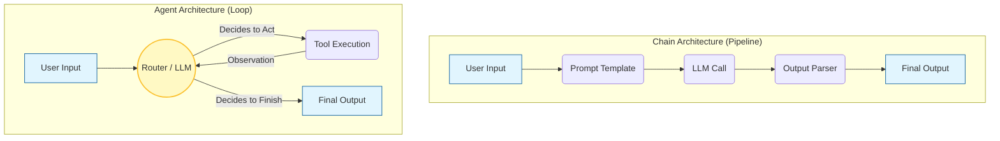

# Introduction to LangChain

Here is a comprehensive introduction to **LangChain**, structured for an engineering audience. It moves beyond the basic "hello world" examples to explain the architectural role, component design, and production considerations of the framework.

---

## Engineering Guide to LangChain

**Estimated Read Time:** 12 Minutes
**Core Value:** Orchestration, Interoperability, and Abstraction.

## 1. Introduction: What is LangChain?

LangChain is an open-source **orchestration framework** for building applications powered by Large Language Models (LLMs).

In software engineering terms, think of LangChain as the **middleware** or **glue layer** between your business logic, data sources, and the raw LLM APIs (like OpenAI or Anthropic). It standardizes how you interact with models, allowing you to switch providers with minimal code changes, and provides pre-built patterns for complex tasks like RAG (Retrieval Augmented Generation) and Agentic workflows.

**The "Why" for Engineers:**

* **Abstraction:** Write code once, swap models easily (e.g., switch from GPT-4 to Llama-3 locally).
* **Composability:** Build complex workflows (Chains) by piping small, modular components together.
* **Ecosystem:** access to 500+ integrations (Vector DBs, APIs, Tools) out of the box.

---

## 2. The Core Architecture (v0.2+)

Modern LangChain has been modularized to improve stability and reduce bloat. It is no longer a monolithic library.

| Package | Function | Engineering Note |
| --- | --- | --- |
| **`langchain-core`** | The base abstractions (LCEL, Runnables, Messages). | **Stable.** Light dependency. Use this if building your own custom chains/agents. |
| **`langchain`** | The chains, agents, and retrieval strategies. | Contains the application logic and orchestration algorithms. |
| **`langchain-community`** | Third-party integrations (Pinecone, Google Search, AWS). | **Volatile.** Updates frequently. Isolate these dependencies where possible. |
| **`langgraph`** | Advanced agent control flow (Cycles, State). | The successor to legacy "AgentExecutors." **Essential for production agents.** |

---

## 3. Key Components: The Primitives

*The building blocks you will import and configure.*

### A. Model I/O

The standardized interface for interacting with models.

* **Prompts:** Uses `PromptTemplate` to separate hard-coded instructions from dynamic user input.
* **LLMs vs. Chat Models:** Distinguishes between text-in/text-out (legacy) and message-based (System/Human/AI) interactions.
* **Output Parsers:** Transforms raw text into structured data (JSON, Pydantic objects) for downstream code usage.

### B. Retrieval (The RAG Stack)

Components designed to fetch data outside the model's training set.

* **Document Loaders:** ETL tools to scrape PDFs, GitHub repos, or S3 buckets.
* **Text Splitters:** Algorithms to chunk text (e.g., `RecursiveCharacterTextSplitter`) to fit context windows.
* **Vector Stores:** Abstractions to write/read from DBs like Pinecone, Milvus, or PGVector.
* **Retrievers:** The logic for fetching. Includes advanced methods like *Self-Querying* (using LLM to filter DB metadata) or *Parent Document* retrieval.

### C. Chains (LCEL)

**LangChain Expression Language (LCEL)** is a declarative syntax for piping steps together. It handles parallelism, retries, and streaming automatically.

* *Syntax:* `chain = prompt | model | output_parser`
* *Behavior:* The output of `prompt` is streamed into `model`, whose output is parsed by `output_parser`.

### D. Memory

*Warning: In modern LangGraph architectures, "Memory" is replaced by "Persistence/Checkpointing".*

* **Short-term:** Storing the last  messages of a chat session.
* **Long-term:** Storing summaries or entities in a database to recall across different sessions.

---

## 4. LangChain vs. LangGraph

This is the most critical distinction for 2025/2026 development.

| Feature | LangChain (Chains) | LangGraph |
| --- | --- | --- |
| **Structure** | Directed Acyclic Graph (DAG). | Cyclic Graph (Loops permitted). |
| **Flow** | Linear: Step A  Step B  Step C. | State Machine: Step A  Check Logic  (Back to A OR Proceed to B). |
| **State** | Passing data between steps (limited). | **Persistence:** Maintains global state (memory) across the entire lifecycle. |
| **Use Case** | Simple Chatbots, basic RAG, Q&A pipelines. | **Agents:** Systems that need to plan, retry errors, and loop until a task is done. |

**Engineering Verdict:** Start with **LangChain** for simple pipelines. Move to **LangGraph** immediately if you need an Agent that can "self-correct."

---

## 5. Production Considerations

* **Latency:** LangChain adds a small overhead (ms) due to abstraction layers. For ultra-low latency, raw API calls might be better.
* **Debugging:** Chains can become "black boxes." You typically need **LangSmith** (their observability platform) to trace exactly what prompt was sent to the LLM inside a complex chain.
* **Dependency Hell:** `langchain-community` is huge. In production, be careful about pinning versions to avoid breaking changes in 3rd party integrations.

---

[LangChain Core Components Explained!](https://www.google.com/search?q=https://www.youtube.com/watch%3Fv%3Dgzx5jd4CS70)
This video provides a focused, hands-on breakdown of the core LangChain components (Models, Prompts, Parsers) and demonstrates how they fit together to build a functional RAG application.
